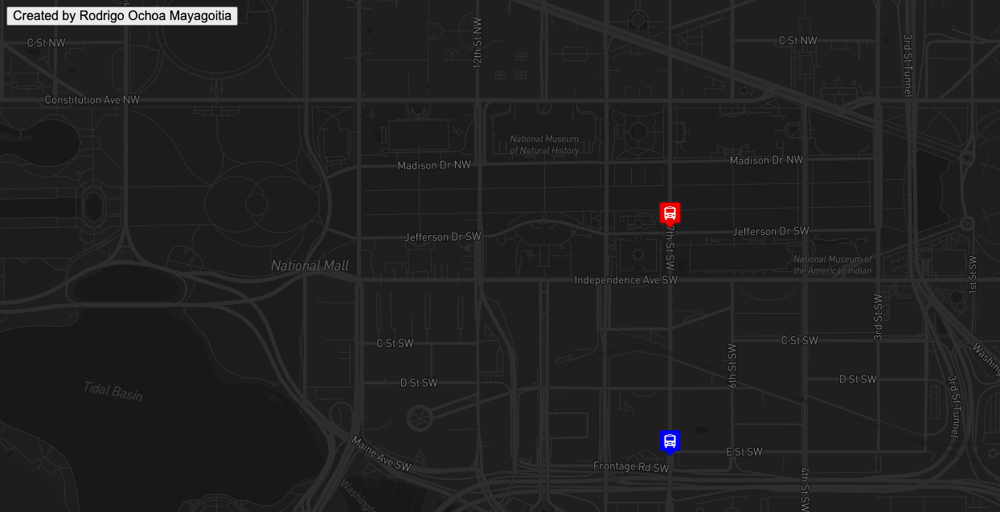

# WMATA Bus Tracker

## Project Description

The WMATA Bus Tracker is a web application that provides real-time public transport route information using the Washington Metropolitan Area Transit Authority (WMATA) API. This project is designed to help users track a public route and view it on a map.

### Features

- Real-time bus tracking: See the current location of WMATA buses on the map.
- Route information: Get details about bus routes, stops, and schedules.
- Interactive Map: Utilizes the Mapbox API to display an interactive map with bus locations and routes.

### Technology Stack

- HTML, CSS, and JavaScript for the front-end.
- WMATA API to fetch real-time public transport data.
- Mapbox API for displaying interactive maps.

## How to Run Locally

To run the WMATA Bus Tracker locally on your machine, follow these steps:

1. Clone this repository to your local machine:

   ```bash
   git clone https://github.com/rodrigoochoam/bus_washington.git

2. Navigate to the project directory:

    ```bash
    cd wmata-bus-tracker

3. Start a local server to serve the project.

    ```bash
    npx http-server

4. Once the local server is running, open your web browser and go to the server's address (usually http://localhost:8080 or similar) to access the WMATA Bus Tracker.

## Live Demo
You can try the WMATA Bus Tracker online by visiting the website at https://bustracker-rom.netlify.app/ The live demo allows you to explore the application without setting up a local server.

## Roadmap of Future Improvements

The WMATA Bus Tracker project is continually evolving, and there are numerous enhancements you can consider:

Adding more advanced filtering and search options for bus routes.
Incorporating real-time arrival predictions for bus stops.
Implementing user authentication and personalization features.

## License Information

This project is open source and available under the MIT License. You are free to use, modify, and share it according to the terms of the license.